<div align="center">

# Callsign

Generate AC6-style codenames for projects and tools

[![Live][badge-site]][url-site]
[![HTML5][badge-html]][url-html]
[![CSS3][badge-css]][url-css]
[![JavaScript][badge-js]][url-js]
[![Claude Code][badge-claude]][url-claude]
[![License][badge-license]](LICENSE)

[badge-site]:    https://img.shields.io/badge/live_site-0063e5?style=for-the-badge&logo=googlechrome&logoColor=white
[badge-html]:    https://img.shields.io/badge/HTML5-E34F26?style=for-the-badge&logo=html5&logoColor=white
[badge-css]:     https://img.shields.io/badge/CSS3-1572B6?style=for-the-badge&logo=css3&logoColor=white
[badge-js]:      https://img.shields.io/badge/JavaScript-F7DF1E?style=for-the-badge&logo=javascript&logoColor=black
[badge-claude]:  https://img.shields.io/badge/Claude_Code-CC785C?style=for-the-badge&logo=anthropic&logoColor=white
[badge-license]: https://img.shields.io/badge/license-MIT-404040?style=for-the-badge

[url-site]:   https://callsign.neorgon.com/
[url-html]:   #
[url-css]:    #
[url-js]:     #
[url-claude]: https://claude.ai/code

</div>

---

## Overview

Callsign names your projects and the tools around them the way Armored Core VI
names its parts. A project gets a frame designation and a 3-letter acronym you
can say out loud; a service gets a weapon name from the same manufacturer. Every
house keeps its own grammar, and the same words always give the same name.

**Live:** callsign.neorgon.com

---

## Features

- **Forge** -- type what you are naming, pick a slot and a house, and get plates with a designation, a 3-letter acronym and 4-letter variants
- **Fifteen houses** -- each in-game manufacturer's naming grammar, from Furlong's `BML-G1/P20MLT-04` codes and IBIS-style `IB-C03H: HAL 826` plates to entomologists' surnames, haiku poets and German birds
- **Acronyms from your words** -- "release automation daemon" gives RAD; type RAD on its own and the houses that carry letters stamp it into their codes
- **Garage** -- name a whole system as one build: the frame for the project, inner parts for the platform, four weapons for its tools
- **Matched frames** -- head, core, arms and legs share one line name, the way a game frame does, or switch to mixed parts
- **Deterministic rolls** -- Reroll moves forward, Back moves back, and a share link reopens the exact build
- **Export** -- a Markdown table for a README, JSON for a script, or plain text for a chat message
- **Hangar** -- saved builds stay in this browser's local storage; nothing is sent anywhere

---

## How a name is built

| Slot | Names | Answers to |
|---|---|---|
| Head | frontend, dashboard, client app | acronym |
| Core | main API or backend service | acronym |
| Arms | integrations, SDKs, adapters | acronym |
| Legs | infrastructure, hosting, runtime | acronym |
| Booster | CI/CD, deploys, release automation | acronym |
| FCS | monitoring, alerting, analytics | acronym |
| Generator | database, queue, event bus | acronym |
| Expansion | failover, kill switch, backups | acronym |
| Weapons | one tool or service each (rifle for a general service, missile launcher for a scheduler, pulse shield for auth, pile bunker for a one-shot migration, and so on) | name |

A plate is a pure function of what you typed, the house, the slot and the roll
number. Houses stamp only a code and a name; acronyms, readings and the callsign
are assembled the same way for every house, in `js/forge.js`.

The word pools are Callsign's own picks from public sources in the same vein as
each manufacturer, with every in-game proper name left out. In-game part names
appear on the Houses page only as reference examples, and `js/canon.js` rerolls
any plate that lands exactly on a real part's designation (it holds hashes of
the 231 designations, not the names). The themes are patterns read off the part
names, not statements from the developers. Callsign is an unofficial fan tool,
not affiliated with FromSoftware or Bandai Namco Entertainment.

**Sources for the grammars:** the official AC6 online manual and patch notes
1.05 to 1.07, the Wikidot AC6 wiki's part descriptions, the part data in
[matteosal/ac6-advanced-garage](https://github.com/matteosal/ac6-advanced-garage),
and Wikipedia's lists of entomologists and of the Purple Forbidden and Supreme
Palace enclosures.

---

## Running locally

ES modules require an HTTP server (not `file://`):

```bash
make serve    # http://localhost:8886
```

---

## Architecture



```
callsign-site/
├── index.html            # App shell: Forge, Garage and Houses views
├── css/
│   └── style.css         # Site styles; tokens come from the CDN base.css
├── js/
│   ├── app.js            # Entry point
│   ├── state.js          # Session, hangar, share-link codec
│   ├── forge.js          # seed + house + slot + roll -> plate; garage rows
│   ├── houses.js         # One grammar per manufacturer
│   ├── lexicon.js        # Original word pools per house theme
│   ├── canon.js          # Hashes of real part designations, to reroll collisions
│   ├── slots.js          # Parts and weapon classes, and what each names
│   ├── acronym.js        # 3 and 4 letter picks from your words or the name
│   ├── expand.js         # Readings for letters that did not come from words
│   ├── rng.js            # Seeded hash + PRNG
│   ├── export.js         # Markdown, JSON and text
│   ├── templates.js      # Shared HTML fragments
│   ├── render*.js        # One module per view
│   ├── events.js         # User interactions
│   └── utils.js          # Copy, download, toast
├── docs/architecture.mmd # Diagram source
├── CNAME
├── Makefile
└── README.md
```

---

<div align="center">
<sub>Part of <a href="https://neorgon.com/">Neorgon</a></sub>
</div>
